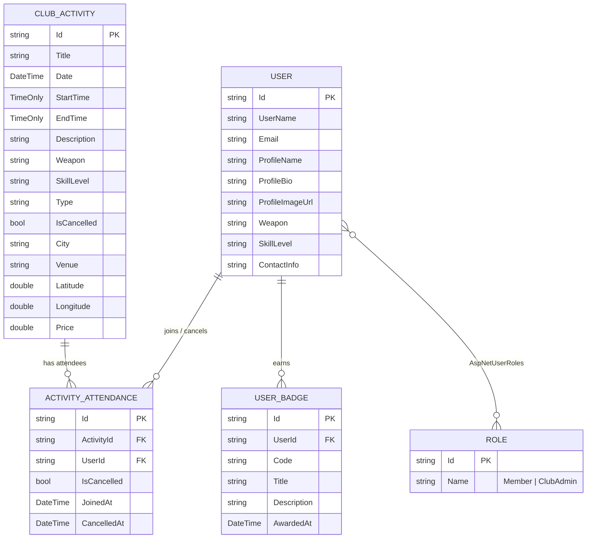
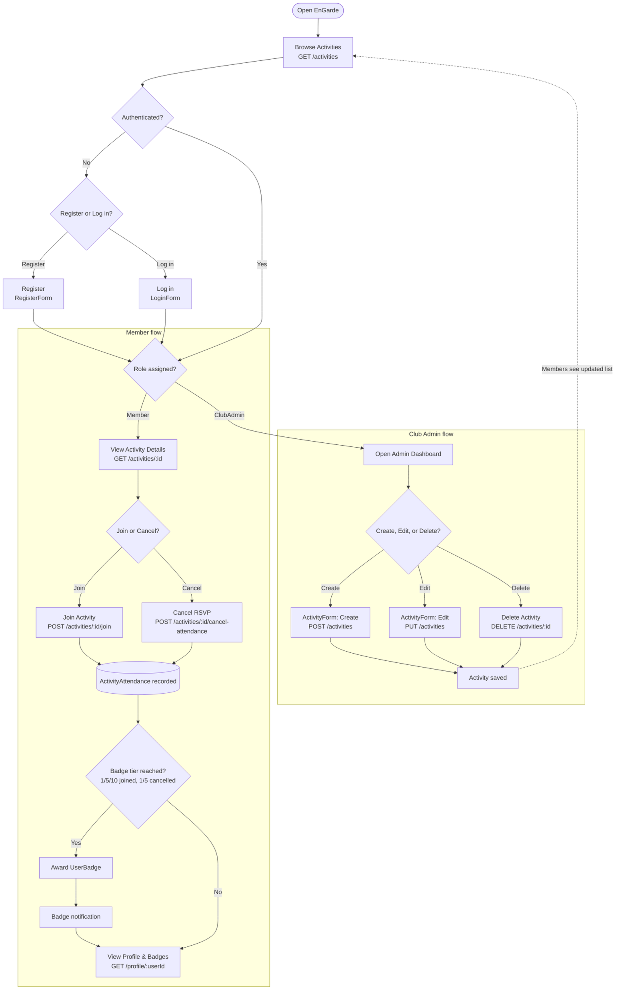

# Architecture Diagrams

_Generated with Claude Code on 2026-08-01 (session `b86a95ac`, see `specs/sessions/2026-08-01.md`)
after checking the actual EF Core models (`backend/Models`, `backend/Data/AppDbContext.cs`) and
routes (`frontend/src/app/router/Routes.tsx`, `backend/Controllers/ActivitiesController.cs`), so
these reflect the real schema and flows rather than a guessed/idealized design._

## 1. Entity Relationship Diagram (ERD)

Reflects the actual EF Core model in `backend/Models` and `backend/Data/AppDbContext.cs` (SQLite, ASP.NET Core Identity).

### Relationships

| Relationship | Cardinality | Notes |
|---|---|---|
| `User` → `ActivityAttendance` | 1‑to‑many | One user can join many activities over time. Enforced by a unique index on `(ActivityId, UserId)` — a user has **at most one** attendance row per activity; rejoining after cancelling flips `IsCancelled` back to `false` rather than inserting a new row. |
| `ClubActivity` → `ActivityAttendance` | 1‑to‑many | One activity has many attendees. |
| `User` ↔ `ClubActivity` | many‑to‑many | Realized through `ActivityAttendance` as the join entity (with extra attributes `JoinedAt`, `CancelledAt`, `IsCancelled`), not a plain join table. |
| `User` → `UserBadge` | 1‑to‑many | A user accumulates one row per distinct badge earned. Enforced by a unique index on `(UserId, Code)`. |
| `User` ↔ `Role` | many‑to‑many | Standard ASP.NET Core Identity relationship via the built‑in `AspNetUserRoles` join table (`IdentityUserRole<string>`), backed by real FK constraints with cascade delete. |

### Assumptions & Notes

- **No standalone `Badge` master table.** Badge definitions (code, title, description, threshold) are hardcoded tiers in `Activities/AttendanceBadges.cs` (`ActivityBadgeCodes`), not database rows. `UserBadge` denormalizes `Code`/`Title`/`Description` at award time, so there is no `Badge`↔`UserBadge` FK — `UserBadge` is a flat "award record," not a join table.
- **Attendance status is a boolean, not an enum.** `ActivityAttendance.IsCancelled` (plus `CancelledAt`) plays the role of the suggested `Status` field.
- **`ActivityId`/`UserId` are plain string columns, not EF‑configured foreign keys.** `AppDbContext` only declares unique indexes on `ActivityAttendance` and `UserBadge` — there are no `HasOne()/WithMany()` navigations wiring them to `ClubActivity`/`User` at the database level. Referential integrity for those two tables is enforced by application logic, not a DB constraint. (By contrast, Identity's own tables — `AspNetUserRoles`, `AspNetUserClaims`, etc. — do have real FKs with cascade delete.)
- The entity is named `ClubActivity` in code, not `Activity`.
- `Role` here is ASP.NET Identity's built‑in `IdentityRole` (table `AspNetRoles`); the app only defines two role names as constants (`Roles.Member`, `Roles.ClubAdmin`) rather than a custom `Role` entity.

---

## 2. User Flowchart

Reflects real routes/guards in `frontend/src/app/router/Routes.tsx` and endpoints in `backend/Controllers/ActivitiesController.cs`.

### Flow Notes

- **Member flow** requires the `Member` role (`RequireAuth` + `RequireRole allow={["ClubAdmin"]}` gates on the create/manage routes imply the un-gated activity routes are the Member path). Join/cancel actions are `[Authorize(Roles = Roles.Member)]` server-side.
- **Badge eligibility** is re-checked after every join *and* every cancellation (`AwardAttendanceBadgesIfEligible` / `AwardCancellationBadgesIfEligible`), since both attended-count and cancelled-count tiers exist.
- **Club Admin flow** is gated by `RequireRole allow={["ClubAdmin"]}` on `/activities/createActivity` and `/manage/:id`, and by `[Authorize(Roles = Roles.ClubAdmin)]` on the `POST`/`PUT`/`DELETE` endpoints.
- The dashed line back to **Browse Activities** shows that admin CRUD actions immediately affect what members see on the shared activity list — there's no separate "publish" step.
